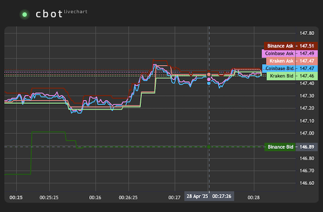
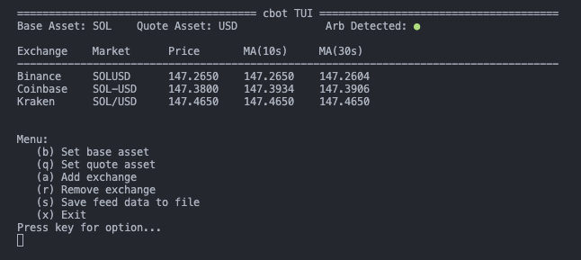

# cbot

A crypto CEX feed data visualization tool in C++ for fun


## Screenshots





## Dependencies

- Boost libraries
- OpenSSL
- `cpp-httplib`

## Build Dependency

### macOS

Install dependencies using Homebrew:

```sh
brew install boost openssl cmake
```

### Debian/Ubuntu

Install dependencies using apt:

```sh
sudo apt install -y \
    libboost-all-dev \
    libssl-dev \
    nlohmann-json3-dev \
    build-essential \
    cmake \
    git
```

## Build Instructions

### Local build

Here are the example build commands for Linux and macOS:

```sh
mkdir build && cd build
cmake ..
make -j$(nproc)

# start the bot with:
./cbot
```
* Windows platform is not supported, please use Docker to build and run `cbot` on Windows.

### Docker build

```sh
docker build . -t cbot
docker run -it -p 18080:18080 cbot
```

## Get Started

Live Chart Web Server:

```sh
http://localhost:18080/
```

Log path:

```sh
~/.local/share/cbot/logs/cbot.log
```
